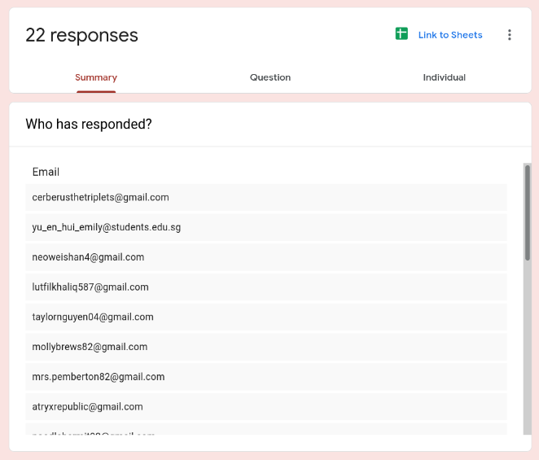
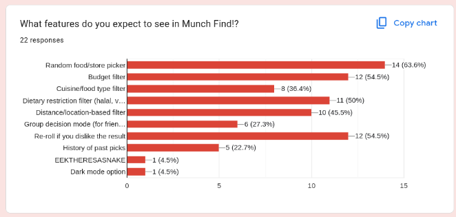
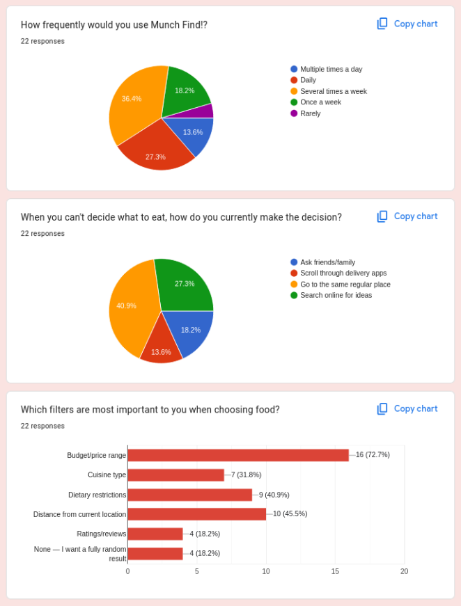
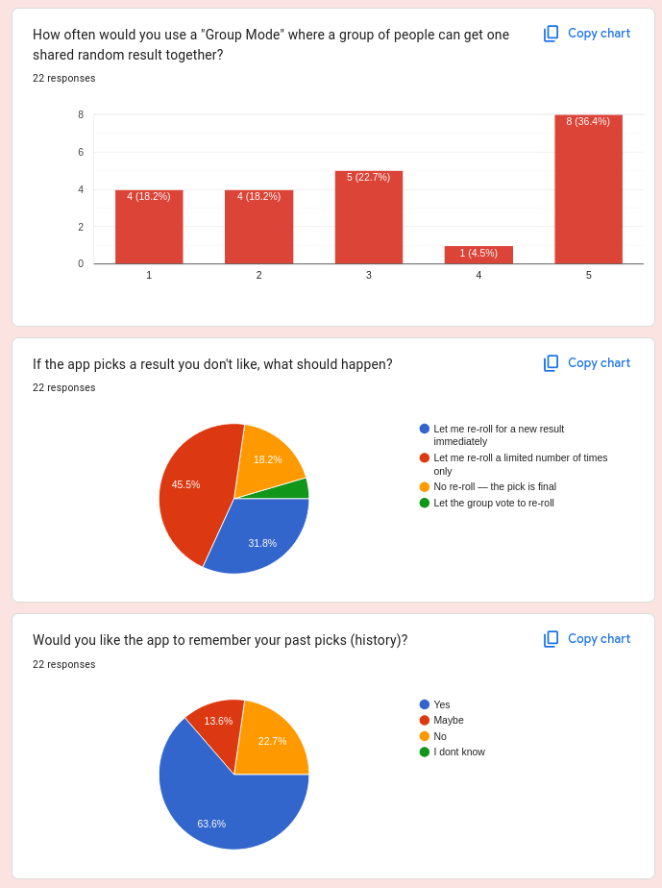
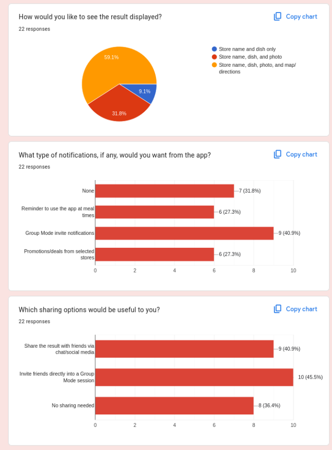
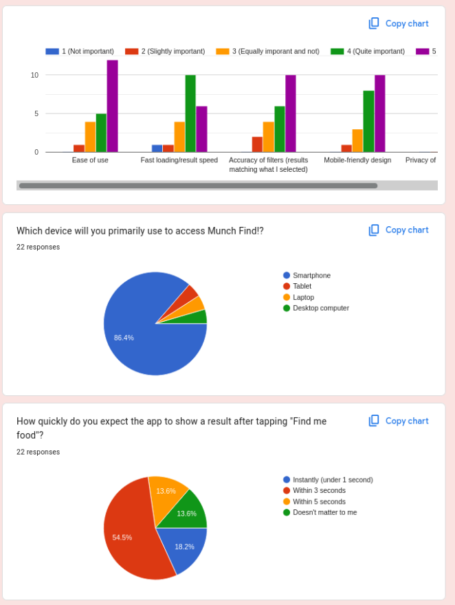

# **Survey Questionnaire/Results**
[Styled/Docx Version](/documentation/docx/1.2.1%20Survey%20Questionnaire.docx)

**MUNCH FIND\!**

━━━━━━━━━━━━━━━━━━━━━━━━━━━━━━━━━━━━━━━━

**App Category:** Productivity

**App Name:** MunchFind

**App Description:** App that solves decision fatigue around food choices. By choosing a random food for the user

**Group Members:** \*\*\*

**Date:** 29 Jul 2026

# **1\. Google Form link**

[https://docs.google.com/forms/d/e/1FAIpQLSfkg\_ftGVu8mzp7as7IDKW769iamBKTxjtjDQi5TFEPIavMMg/viewform](https://docs.google.com/forms/d/e/1FAIpQLSfkg_ftGVu8mzp7as7IDKW769iamBKTxjtjDQi5TFEPIavMMg/viewform) 

# **2\. Screenshot of responses

</img>
</img>
</img>
</img>
</img>
</img>

### **What additional features would you like to suggest for Munch Find\!?** 

### 13 responses

* Something that accounts for how much actual time I have left on my break. I tell it 15 minutes it should only suggest places I can realistically get to, order from, and get back in time for  
* a "budget mode" for splitting group orders would be great. half my group can't agree on price range either. Also, maybe let the app learn what I usually reject over time so the re-rolls get smarter instead of just random again.  
* A leaderboard of most-picked restaurants among friends would be fun  
* Would love a 'group budget split' calculator feature  
* Allergy warnings should be very prominent, not buried in filters  
* Not sure I'd use this much honestly  
* Show student discounts if available  
* Maybe add a 'surprise me' mode that ignores all filters occasionally  
* A clean, minimal UI would make me use this more  
* Please make sure the halal filter is accurate and verified  
* Group voting on the final result before confirming would help

# **3\. Survey analysis summary table**

| Question | Your Answer |
| :---- | :---- |
| Total number of responses | 22 |
| Most requested feature (Q1) | Random food/store picker (64%), followed by re-roll (55%) and budget filter (55%) |
| Least requested feature (Q1) | Dark mode option (5%) |
| How frequently would users use the app? | Most use "Several times a week" or "Daily" |
| How do users currently decide what to eat? | Most just go to their same regular place; others search online |
| Most important filters | Budget/price range by far (16/22), then distance and dietary restrictions |
| Interest in "Group Mode" | Skews high — most rate it 5 (frequent use), average \~3.4/5 |
| What should happen on a disliked result? | Most want a limited number of re-rolls, not unlimited or final |
| Should the app remember past picks (history)? | Yes — 14/22 want history saved |
| Preferred result display | Most want store name, dish, photo, AND map/directions |
| Desired notifications | Group Mode invites top the list, but many want none at all |
| Useful sharing options | Inviting friends into Group Mode and social/chat sharing both popular |
| Importance of ease of use | Very important — avg 4.27/5 |
| Importance of fast loading speed | Still important but the relative lowest — avg 3.86/5 |
| Importance of filter accuracy | Very important — avg 4.09/5 |
| Importance of mobile-friendly design | Very important — avg 4.23/5 |
| Importance of location data privacy | Very important — avg 4.05/5 |
| Most used device | Smartphone, by a huge margin (19/22) |
| Expected result speed | Most expect a result within 3 seconds |
| Requested features (open-ended) | Group budget-splitting, time-aware suggestions, smarter learning re-rolls, "surprise me" mode, verified halal accuracy, restaurant leaderboard, student discounts, clean UI, group voting before confirming, prominent allergy warnings |