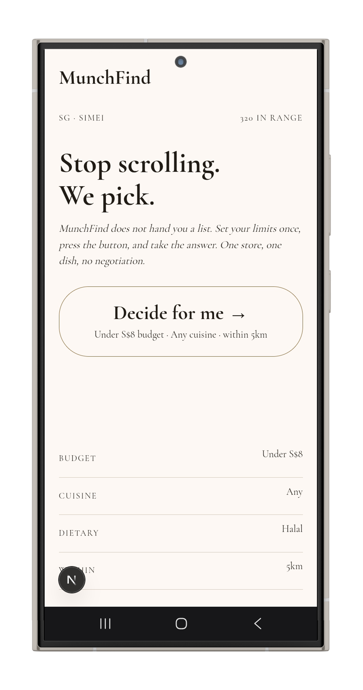
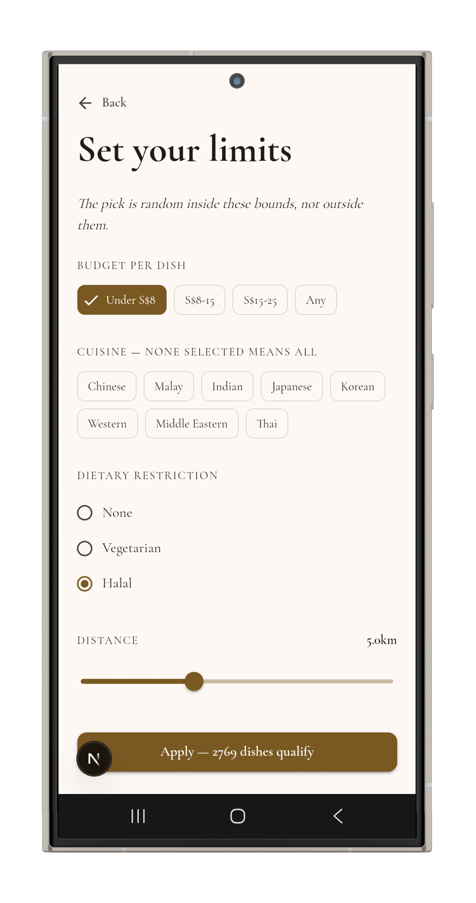
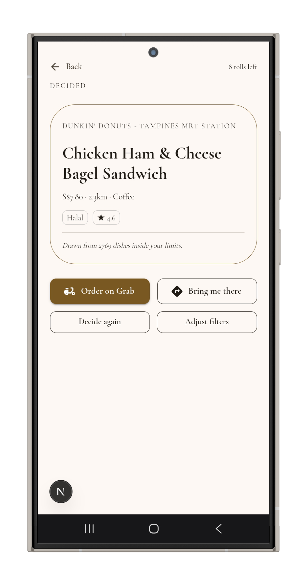

# MUNCH FIND!

> [!NOTE]
>
> - This is a prototype for a graded collage project
> - This app is ~~entirely~~ mostly vibe coded using claude code
> - A small part of this readme is ai generated, the rest is 100% untouched human love

MUNCH FIND! is a [Next.js](https://nextjs.org) Productivity app that solves decision fatigue around food choices. By choosing a random food for the user.

<div>
</img>
</img>
</img>
<div>

# Documentation Tree

- First Submission
    1. [Software application proposal](/documentation/1.1.%20Proposal.md)
    2. Survey Questionare ans results
        - [Survey/interview questionnaire](/documentation/1.2.1%20Survey%20Questionare.md)
        - [result summary](/documentation/1.2.2%20User%20Requirements.md)
- Final Submission
    1. [Design document](/documentation/2.1%20Design%20Document.md)
    2. Use Case / Storyboards
        - [Claude artifact](https://claude.ai/public/artifacts/eb5e3eef-877c-4d1e-9373-c52644d5226b)
        - [Raw source code](https://raw.githubusercontent.com/LuluHuman/munchfind/refs/heads/main/documentation/2.2%20Storyboard.html)
        - [Human storyboard](/documentation/images/storyboard-human.png)
    3. [Gantt chart](https://raw.githubusercontent.com/LuluHuman/munchfind/refs/heads/main/documentation/2.3%20Ghantt%20Chart.pdf)
    4. Project prototype (basically this)
    5. [Presentation slides](https://docs.google.com/presentation/d/1PkxTSHSHZD7U9GntS6f_KqG--uAILAlxfux7BGAjMro/edit?usp=sharing)

# Overview

Munch Find\! is a mobile/web application that solves decision fatigue around food choices by randomly selecting a store and dish for the user, rather than presenting yet another list to scroll through. When a user can't decide what to eat, they simply open the app, apply optional filters such as budget, location, or dietary needs, and let the app choose for them. For groups, Munch Find\! offers a shared decision mode, where everyone joins a session and the app picks one option that the whole group commits to, removing the usual back-and-forth of "you choose" and the blame that follows a bad pick.

The operational need behind this project is simple: existing food delivery platforms are built to maximise browsing, not to minimise it. They show users more choices, not fewer, which actively works against people who are tired, busy, or simply can't agree with the people they're eating with. There is currently no widely-used tool that removes the choice itself as the point of value, rather than adding to it.

The expected outcome is a working prototype that demonstrates this core decision-removal mechanic, built and validated with real user input through survey and interview data. Success for this project means a functional prototype that a genuinely indecisive user, or a genuinely indecisive group, could open and use to solve the "what should we eat" problem in under a minute.

# What's actually in the prototype

- **Random pick engine** &mdash; land on the homepage, hit go, get one restaurant and one dish. No list, no scrolling.
- **Optional filters** &mdash; narrow the pool by budget, cuisine, dietary restriction, and distance (`/filters`) before rolling. Filter choices persist in a cookie (`mf_filters`) so they stick between visits.
- **Reroll cap** &mdash; rerolling a result is capped at 10 rolls per hour (tracked client-side via `localStorage`), so the app still nudges you toward committing instead of re-rolling forever. See [rolls.ts](/src/lib/rolls.ts).
- **Result page** &mdash; `/result` calls the result API, shows the picked dish/restaurant, and lets you reroll within the cap.
- **Seeded local dataset** &mdash; real restaurant + full menu data scraped from Grab, one JSON file per restaurant under [src/data/restaurants/](/src/data/restaurants/), built into a local SQLite database ([munchfind.sqlite](/src/data/munchfind.sqlite)) via `npm run db:build` ([build-db.mjs](/scripts/build-db.mjs)). See [disclosure.md](/src/data/disclosure.md).
- **Small API surface** &mdash; `/api/result` (pick a dish given current filters), `/api/restaurants/count` (pool size for the current filters), `/api/location` (currently hardcoded to Simei, SG &mdash; see the disclaimer above).

# Tech Stack

- [Next.js](https://nextjs.org) 16 (App Router) + React 19 + TypeScript
- [MUI](https://mui.com/material-ui/) with a custom Material 3 theme ([src/theme/](/src/theme/)) for the UI
- Tailwind CSS 4 for the odds and ends
- Node's built-in `node:sqlite` for the local restaurant/dish database, built from scraped JSON source data via a script, not an ORM

# Getting Started

First, Clone this thing

```bash
git clone https://github.com/LuluHuman/munchfind.git
# or
git clone git@github.com:LuluHuman/munchfind.git
# or
gh repo clone LuluHuman/munchfind
```

Then install the dependencies this depends on

```bash
npm i
# or
yarn i
# or
pnpm i
# or
bun i
```

Lastly, run this development ahh server:

```bash
npm run dev
# or
yarn dev
# or
pnpm dev
# or
bun dev
```

Open [http://localhost:3000](http://localhost:3000) with your browser to see this monstrosity.

The repo already ships a built [munchfind.sqlite](/src/data/munchfind.sqlite), so this is optional, but if you touch the source data under [src/data/restaurants/](/src/data/restaurants/) you'll want to regenerate the database:

```bash
npm run db:build
```

# Contributors

This project is was planned, written and developed by Lutfil, nurin, Danique and Refqi

# Links

Live examples are at <a href="munchfind://sussie.luluhoy.tech">https://munchfind.luluhoy.tech</a>
